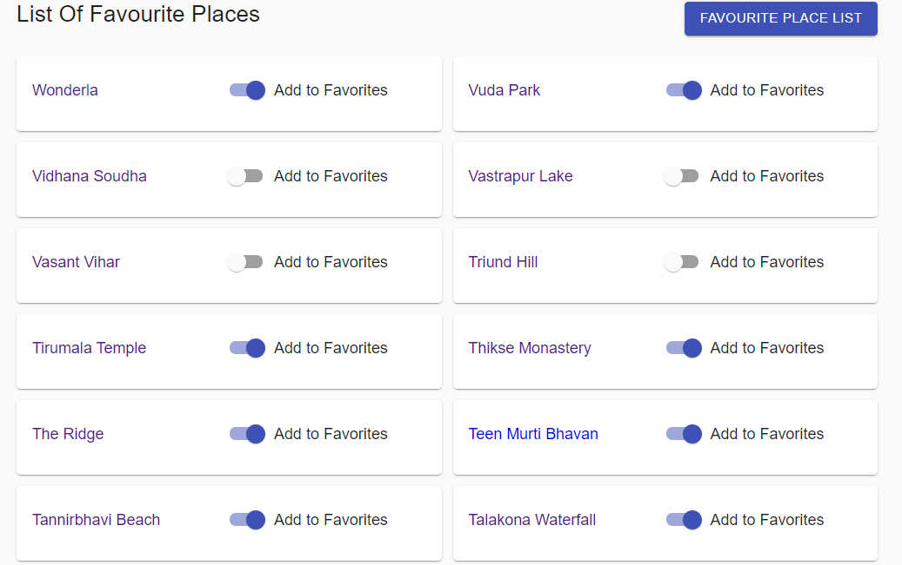

# Favourite Places(React, Redux)

### Setup
Below are the steps to get it running.

1. `npm install`  Installs all the dependencies.
2. `npm start`  Starts the application.

Once the server is up the site will be available at `http://localhost:3000/`

#### Approach
I have created the application with create react app, and below is the pattern followed in the implementation

##### Components 
- The complete app is divided in to multiple reusable components/views to maintain the code's reusability, 
each component is independent of each other and can be reused wherever it's require with custom data.
- I have used material UI as a base and created wrappers around the components for customisation based on the mock up.

##### Containers
- Components are wrapped with containers to get the Redux state and actions as props.
- Followed the styled components pattern.

##### Actions
- Actions are plain javascript objects with TYPE property in it, actions will be dispatched based on user interactions with the application.

##### Reducers 
- Reducers are pure functions which will take action object as input parameters and will update the Redux state accordingly.
- I created the individual reducers for each action to follow a TDD approach and to make it more maintainable and readable.

##### Constants 
- Constants are used to define the STATIC DATA in the application.

### Sample screens

